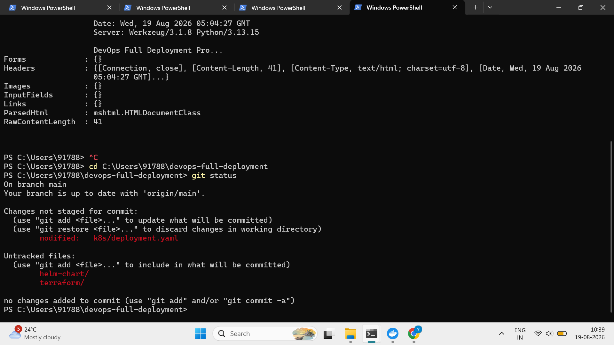
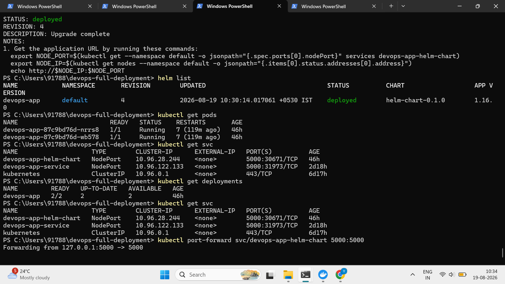

\# DevOps Full Deployment Project

A complete DevOps deployment project demonstrating application containerization, Kubernetes deployment, Git version control, and CI/CD automation using GitHub Actions.

\## Architecture

Developer

&#x20;  |

&#x20;  v

GitHub Repository

&#x20;  |

&#x20;  v

GitHub Actions

&#x20;  |

&#x20;  +--> Python Test

&#x20;  |

&#x20;  +--> Docker Build

&#x20;  |

&#x20;  +--> Push Image to GitHub Container Registry

&#x20;  |

&#x20;  v

GHCR

&#x20;  |

&#x20;  v

Kubernetes

&#x20;  |

&#x20;  +--> Deployment

&#x20;  |

&#x20;  +--> 2 Application Pods

&#x20;  |

&#x20;  v

Kubernetes Service

&#x20;  |

&#x20;  v

Flask Application

\## Technologies

\- Python

\- Flask

\- Docker

\- Kubernetes

\- Git

\- GitHub

\- GitHub Actions

\- GitHub Container Registry

\- PowerShell

\## Application

The application is a simple Flask application.

Application endpoint:

http://localhost:8080

Expected response:

DevOps Full Deployment Project is Running

\## Docker

Build the Docker image:

docker build -t devops-app:1.0 .

Run the container:

docker run -d --name devops-app-container -p 5000:5000 devops-app:1.0

Check running containers:

docker ps

\## Kubernetes Deployment

Apply the Kubernetes manifests:

kubectl apply -f k8s/

Check deployments:

kubectl get deployments

Check pods:

kubectl get pods

Check services:

kubectl get services

\## Service Testing

Port-forward the Kubernetes service:

kubectl port-forward service/devops-app-service 8080:5000

Test the application:

Invoke-WebRequest http://localhost:8080

Expected HTTP status:

200 OK

\## Scaling

The Kubernetes Deployment runs two replicas for availability.

Check replicas:

kubectl get deployment devops-app

Expected:

2/2 READY

\## CI Pipeline

GitHub Actions automatically runs when code is pushed to the main branch.

Pipeline stages:

1\. Checkout source code

2\. Setup Python

3\. Install dependencies

4\. Validate Python application

5\. Build Docker image

6\. Login to GitHub Container Registry

7\. Push Docker image to GHCR

\## Container Registry

Docker images are published to GitHub Container Registry.

Image:

ghcr.io/shitreyashraj/devops-full-deployment:latest

\## Kubernetes Rolling Update

Update the deployment image:

kubectl set image deployment/devops-app devops-app=ghcr.io/shitreyashraj/devops-full-deployment:latest

Monitor rollout:

kubectl rollout status deployment/devops-app

Verify pods:

kubectl get pods

\## Troubleshooting

Check pod details:

kubectl describe pod <pod-name>

Check application logs:

kubectl logs <pod-name>

Check service endpoints:

kubectl get endpoints devops-app-service

Check deployment status:

kubectl get deployment devops-app

\## Project Result

The project demonstrates:

\- Source code management with Git

\- Docker containerization

\- Kubernetes deployment

\- Kubernetes service exposure

\- Multiple application replicas

\- Rolling deployment

\- GitHub Actions CI automation

\- Docker image publishing to GHCR

## Deployment Screenshots

### Kubernetes Deployment

### Terraform Deployment

